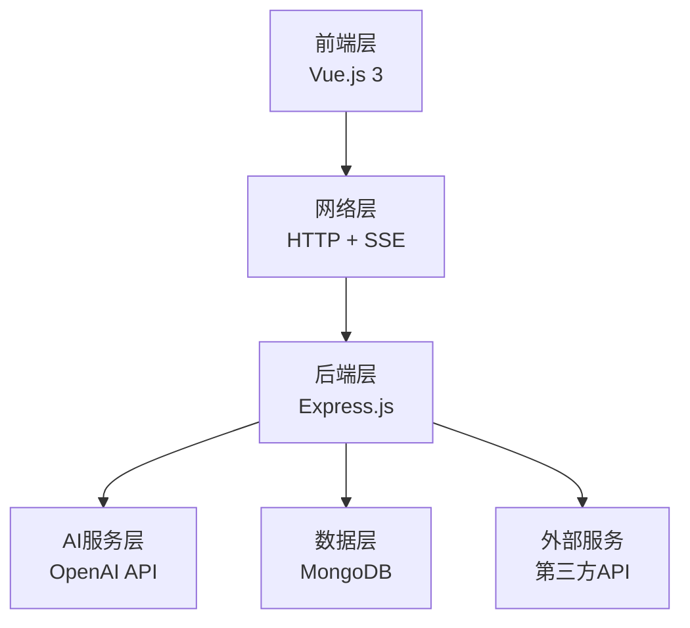
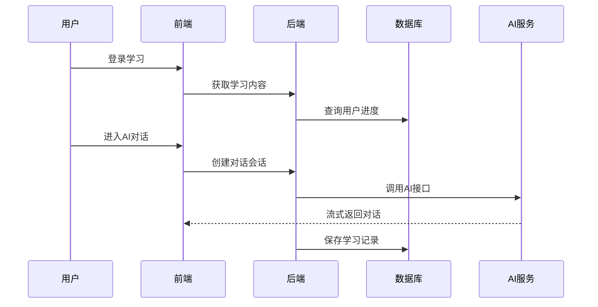

# 英语练习闯关网站 - 系统架构

## 🏗️ 系统架构图

## 📋 各层解释

### 🎨 **前端层**
**技术**: Vue.js 3 + TypeScript  
**功能**: 5关闯关界面，实时AI对话，学习进度管理

### 🌐 **网络层**  
**技术**: RESTful API + Server-Sent Events  
**功能**: 数据传输，流式AI对话，Session管理

### ⚙️ **后端层**
**技术**: Node.js + Express.js  
**功能**: 用户认证，章节管理，业务逻辑处理

### 🤖 **AI服务层**
**技术**: OpenAI API集成  
**功能**: 智能出题，对话交互，流式传输

### 💾 **数据层**
**技术**: MongoDB  
**功能**: 用户数据，单词库，学习进度，对话记录

### 🔌 **外部服务**
**技术**: 第三方API  
**功能**: 单词释义，语音合成，邮件服务

## 🔄 **核心流程**

## 🚀 **核心特色**

- **流式AI交互**: 实时对话体验
- **5关递进学习**: 科学学习路径  
- **场景化练习**: 酒店餐厅等真实场景
- **个性化出题**: 基于学习数据的AI出题